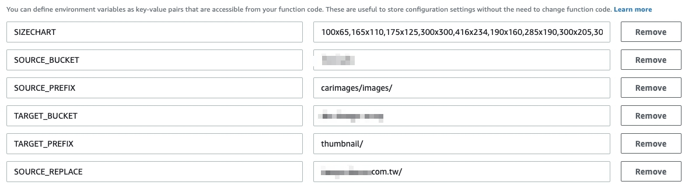

# Lambda-s3-images-resize

<!-- English | [繁體中文](./README.zh-TW.md) -->

<p align="center">
  <a href="#">
    
  </a>
</p>


[](https://github.com/Naereen/StrapDown.js/blob/master/LICENSE)

## How to use?
```
$ zip -r code.zip
```
Upload to AWS Lambda function

## Environment variables

 - SIZECHART - Split with ','. ex: 300x300,100x100...
 - SOURCE_BUCKET - Your source image s3 bucket.
 - SOURCE_PREFIX - Your source prefix path.
 - TARGET_BUCKET - Your target s3 bucket.
 - TARGET_PREFIX - Your target prefix path.

## Execution role
Must be attach a ROLE from below policy to AWS Lambda function.
```
{
  "Version": "2012-10-17",
  "Statement": [
    {
      "Effect": "Allow",
      "Action": [
        "logs:CreateLogGroup",
        "logs:CreateLogStream",
        "logs:PutLogEvents"
      ],
      "Resource": "arn:aws:logs:*:*:*"
    },
    {
      "Effect": "Allow",
      "Action": [
          "s3:PutObject",
          "s3:GetObject"
      ],
      "Resource": [
        "arn:aws:s3:::__YOUR_SOURCE_BUCKET_NAME_HERE__/*",
        "arn:aws:s3:::__YOUR_TARGET_BUCKET_NAME_HERE__/*"
      ]
    }
  ]
}
```

## API Gateway Setting

Use CLI to get CONVER_TO_BINARRY.
```
aws apigateway update-integration-response \
        --rest-api-id xxxxxx \
        --resource-id xxxxxx \
        --http-method [ ANY | GET | POST ] \
        --status-code 200 \
        --patch-operations "[{\"op\" : \"replace\", \"path\" : \"/contentHandling\", \"value\" : \"CONVERT_TO_BINARY\"}]"
```
  1. In API Gateway, enable Use Lambda Proxy integration for your API. (This setting is located on the Integration Request section, where you had set the type to Lambda.)
  2. In API Gateway, select your API and click Settings. In Binary Media Types add */*. (Note: I tried adding simply 'image/jpeg', but it seems to require */* to get all of this to work)
  3. Be sure to deploy your API, otherwise your changes will not be live. (In API Gateway, select your API, then Actions > Deploy API).

## If you have CloudFront befoer the API Gateway

  1. Go to CloudFront Console.
  2. Choose your ID.
  3. Click 'Behavior' tag.
  4. Choose your Lambda function path and click it.
  5. Find **Cache Based on Selected Request Headers** and select **Whitelist**.
  6. Add **Accept** and **Authorization** to right block.
  7. Click **Yes,Edit**
